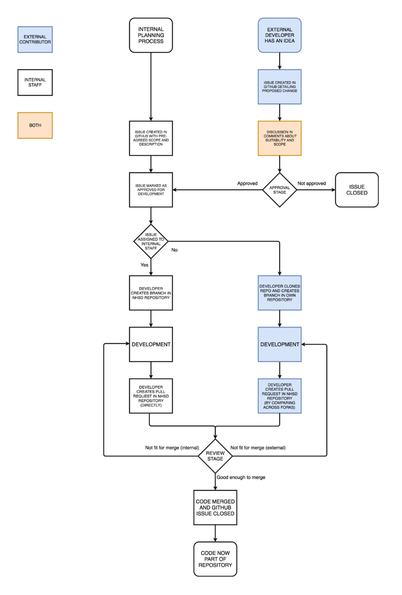

## Executive summary

Our new data strategy, ["Data Saves Lives"](https://www.gov.uk/government/publications/data-saves-lives-reshaping-health-and-social-care-with-data-draft/data-saves-lives-reshaping-health-and-social-care-with-data-draft) repeatedly refers to open source as part of the transformation the NHS must go through to build a more efficient, transparent and integrated health and social care system. Commitments on "working in the open" and "driving interoperability for innovation" both make mention of the role open source has to play alongside information governance and guidance, architectural change and data standards. It is no coincidence that our open source programme sits within the Standards and Interoperability team, and tackles many of the same opportunities and challenges.

One such challenge is the lack of a single position and source of guidance for those developing open software for or with the NHS in England. This document seeks to support a policy that will inform why, how and when staff across the NHS in England should openly publish their programming code. It is aimed largely at CIOs and technical programme leads (especially sections 1, 2, and 3), teams developing new code in house (sections 3 and 4), and those commissioning new work from suppliers (3, 4, and 5). It is a living document, which anyone can comment upon or suggest changes to through GitHub or by email. Every year from Summer 2022, this document will be used to release or update official policy. Comments received after April of that year will form part of the following year’s update.

This document may refer to but does not cover policy on [when to produce or procure](https://nhsengland.github.io/it-standards/#/application-development/common-dev/readme) code in general, [engineering principles](https://github.com/NHSDigital/software-engineering-quality-framework/blob/main/principles.md), [information standards](https://digital.nhs.uk/data-and-information/information-standards/information-standards-and-data-collections-including-extractions/publications-and-notifications/standards-and-collections), [open data](https://digital.nhs.uk/services/supporting-open-data-and-transparency), or open [standards](https://www.gov.uk/government/publications/open-standards-principles/open-standards-principles), which can all be found elsewhere. As part of our broader [standards and interoperability work](https://www.nhsx.nhs.uk/key-tools-and-info/standards-and-interoperability/) it provides necessary context, conduct and assurance requirements for open publication, without replacing [broader guidance on digital and data driven technologies.](https://www.gov.uk/government/publications/code-of-conduct-for-data-driven-health-and-care-technology/initial-code-of-conduct-for-data-driven-health-and-care-technology)

In brief, NHS Open Source Policy applies where work is supported by NHS funding or staff time, and requires that:
* All efforts are made to never solve the same problem twice. All new source code that we produce or commission should be open and reusable by default: such that anyone can freely access, use, modify, and share the relevant code for any purpose;

* New projects justify their exception from open source publishing as part of the NHS digital and technology approval process, marking their projects as Coded In The Open, Open Source, Closed or Secured;

* Projects use GitHub as the NHS’ preferred platform for publishing open source code: All new code should be hosted in an account owned by the commissioning organisation, unit, or community to ensure ongoing management and accountability;

* All projects should be accompanied by an informative README file, a licence and their full text in a LICENCE file. The relevant legal caveats and notices must be included when software could introduce risk or harm to either patients or the intended users of the software;

* Repositories should have clear guidelines on how to contribute to their code (where contributions are accepted). If a project accepts the reporting of security vulnerabilities, guidelines should include a [responsible](https://cheatsheetseries.owasp.org/cheatsheets/Vulnerability_Disclosure_Cheat_Sheet.html) [disclosure process](https://www.ncsc.gov.uk/information/vulnerability-disclosure-toolkit);

* A contact email address and a responsible member of staff are provided to make sure that issues can be addressed. All documentation and conduct should reflect [NHS Values](https://www.hee.nhs.uk/about/our-values/nhs-constitutional-values-hub-0);

* Projects adhere to [best practice](https://www.gov.uk/government/publications/code-of-conduct-for-data-driven-health-and-care-technology/initial-code-of-conduct-for-data-driven-health-and-care-technology) and [common standards](https://nhsengland.github.io/it-standards/#/application-development/common-dev/readme). An internal [code review](https://github.com/NHSDigital/software-engineering-quality-framework/blob/main/patterns/everything-as-code.md#code-review) should be conducted for all open source projects and specific responsibilities must be met within or close to the development team. Changes to code (‘commits’) should be accompanied by [meaningful and informative records](https://www.gov.uk/service-manual/technology/maintaining-version-control-in-coding#writing-commit-messages);

* Additional [security considerations](https://www.gov.uk/government/publications/open-source-guidance/security-considerations-when-coding-in-the-open) are made above and beyond general best practice and specific organisational policies. Project history should be thoroughly reviewed and valid keys and credentials must not be published.

## 1. Why do we open source?

The NHS is home to hundreds of organisations, thousands of analysts and developers, and uncountable lines of programming code. It is almost impossible for staff across the NHS to communicate either best practice or effective solutions to common problems without a framework in place.

Open source code offers that framework. Without it, we rely on word of mouth to promote the best efforts our amazing talent provides. With it, we need **never solve the same problem twice**. Instead, we can focus on improving, evolving, adapting and adopting the best technology the world has to offer for our health and social care system. And more, we can give our work back to the people who fund it, the public: allowing them to more easily join our staff, more quickly develop products and SMEs to support us, and better understand and trust the work we do on their behalf.

Any open code can be reused by our developers to reduce costs, avoid duplication of effort, generally increase staff efficiency, make system changes more quickly and pursue the best approaches, not just those locally available. Publishing under [open licences](https://opensource.org/licenses) (which define the legal terms for free access and reuse) also drives up the quality of services we buy and promotes a more varied ecosystem of products and providers.

Whether it’s in the creation, collaboration or consumption of code, we have good reasons, expert advisory and government commitments around adopting open source. With the ‘why’ in hand, this document and the policy it supports detail the ‘how’ and ‘when’.

### Commitments

Commitments for the adoption of open source code are available in multiple articles of government and NHS policy, including:

* The forthcoming NHS [Data Strategy](https://docs.google.com/document/d/1u7V9iOE80rVzO7P-_pDFBs42p2l14stpa8pIJHYyvkk/edit) “Data saves lives: reshaping health and social care with data”, which contains two relevant commitments on making code that we produce open and reusable. The first of which states: “**We will begin to make all new source code that we produce or commission open and reusable by default** (with clear exceptions) and publish it under appropriate licences to encourage further innovation (such as MIT and OGLv3, alongside suitable open datasets or dummy data) (December 2021). Subject to consultation, the relevant policies will also aim to be open and reusable”;

* The [Future of healthcare: our vision for digital, data and technology in health and care](https://www.gov.uk/government/publications/the-future-of-healthcare-our-vision-for-digital-data-and-technology-in-health-and-care/the-future-of-healthcare-our-vision-for-digital-data-and-technology-in-health-and-care) speaks to interoperability and openness (around standards, culture, technology, and code) as one of it’s four guiding principles;

* The [GDS service manual](https://www.gov.uk/service-manual/technology/making-source-code-open-and-reusable), which states “When you create new source code, you must make it open so that other developers (including those outside government) can: benefit from your work and build on it; learn from your experiences; find uses for your code which you had not found”. The [12th service standard ](https://www.gov.uk/service-manual/service-standard/point-12-make-new-source-code-open)goes further, to suggest that developers: “write code in the open from the start, and publish it in an open repository - minus any sensitive information, like secret keys and credentials” and “keep ownership of the intellectual property of new source code that’s created as part of the service, and make it available for reuse under an open licence”. That text is directly reproduced in the [12th NHS service standard](https://service-manual.nhs.uk/service-standard/12-make-new-source-code-open);

* The government [Technology code of Practice](https://www.gov.uk/guidance/be-open-and-use-open-source) states that “your plans must show you’ve considered using open source and publishing your code openly”, requiring “equal consideration to be given to open source solutions when procuring software”.

These commitments are not without resource implications. This document will help teams understand the practical requirements of openly publishing their code ahead of time, so that they can anticipate staffing needs and factor them into procurement and provision.

## 2. What is open source code?

At its most simple, open source code consists of lines of programming code in any language, and a permissive open licence that governs the legal conditions under which the code is provided. Open source code is specifically provided under a licence that means **anyone can freely access, use, modify, and share the relevant code for any purpose**. It means that regardless of who produced it, anyone can contribute to its further development or use it for their own means without paying a licensing fee, or seeking permission from the contributors.

For more on precise terms, see the Open Knowledge Foundation’s [Open Definition](http://opendefinition.org/od/2.1/en/).

Programmers across the NHS frequently use existing open source packages and modules in their work, especially for routine data [analysis](https://pandas.pydata.org/) or [processing](https://hadoop.apache.org/), or for mobile development (as [part of the NHS App](https://www.nhs.uk/nhs-app/nhs-app-legal-and-cookies/nhs-app-open-source-licences/), for instance). They should be encouraged to do so when creation of a bespoke solution would be unnecessarily burdensome.

  
## 3. When code should be open or closed

By default, all new code funded by the NHS or supported by NHS staff should be open source. But what does this mean, and what are the exceptions to this general rule? All new code should be:

* **Coded In The Open**

* **Open Source** where training needs, technical or procurement requirements prevent Coding In The Open from the start

* **Closed** when it’s impossible to separate code from disclosive or secure information about patients, staff, systems, or infrastructure, or when required by policy, business, or statistical demands

* **Secured** when a specific and explicit legal requirement or larger-scale system integrity prevents its publication

**New projects should start at the top of this list, and justify their exception downwards as part of the NHS digital and technology approval process** under the follow-up questions to “Have you evaluated potential open-source options?”. The rules above may be applied at the project level or, where it is sensible to do so, separately for individual components or packages.

### Coded In the Open

It is much easier to [write your code in the open](https://gds.blog.gov.uk/2012/10/12/coding-in-the-open/) from the beginning of a project than it is to open an existing repository later, and most code should be made open source from the very start of a project. This is especially the case for general research, analysis or innovation projects where the teams involved are well placed to apply best practice progressively or from day one, or where code is commissioned from technically skilled providers. 

### Open Source

Training requirements, access to equipment or tools, or business needs may slow down or prevent the reliable production of code in the open. Where no impediment exists that requires code be Closed or Secured, projects should work towards the best practice outlined in this document (in section 4) and openly publish their code at the earliest opportunity. They should request support from their home organisations to do so under the relevant national commitments and policy.

### Closed

Closed code may be held in private repositories or on platforms that are otherwise not available to the public, but is often shared within team, unit or organisational boundaries. Some code should always be [kept closed](https://www.gov.uk/government/publications/open-source-guidance/when-code-should-be-open-or-closed), including:

* Keys, credentials and secrets for access to secure data or systems

* Code relevant to unreleased: policy, business decisions, or statistical publications

* Algorithms used to detect fraud or that are otherwise only effective when kept private

In the first case, projects must never have keys, credentials and secrets (always Closed) in source code (Open), storing them separately and only accessible by authorised staff. It must be possible for them to be easily and thoroughly changed, rotated or revoked.

In the second case relevant policy, business or statistical oversight mechanisms, including permissions from government authorities (such as the Secretary of State), must be considered. Nonetheless, projects must still develop Closed code as if it’s already open, following good development and security practices. Project managers should then decide on when code will be made open. The default 'cooling off' period should be no greater than six months after product delivery, or up to nine months for code relevant to official statistics, unreleased public policy, or highly commercially sensitive work. Extension to this cooling off period must be agreed by a [Central Government](https://assets.publishing.service.gov.uk/government/uploads/system/uploads/attachment_data/file/519571/Classification-of-Public_Bodies-Guidance-for-Departments.pdf) body and cannot exceed a total of an additional 9 months. 

Once opened, projects should remain so. If specific parts of a project must be kept from public view due to legislative requirement (as with changes to the formulation of some official statistics) they can be forked into a private instance and merged back into the public repo at the earliest opportunity. 

In all three cases (and for all four categories of code), projects should still follow best practice, common standards, and broader guidance.

### Secured

Some code cannot be opened at any time, almost always due to a specific and explicit legal requirement. However, keeping code closed is not enough to ensure that it is secure, and truly confidential code is highly likely to require [defense in depth](https://en.wikipedia.org/wiki/Defense_in_depth_(computing)) to fully mitigate the risk of legal or systemic repercussions in the case of a breach. These strategies include but are not limited to firewalls, administrative controls, encryption, multi-factor authentication and physical security protocols.

## 4. How to open source code

Although the idea of open sourcing code may at first appear intimidating, this document outlines the nine steps that are necessary. The following components turn common coding standards into best practice, helping to ensure that the code produced within and for the NHS fully supports our Commitments and Values. Many examples of best practice are available (and linked throughout) at [local,](https://github.com/yorkshire-and-humber-care-record/fhir-appliance) [national](https://github.com/QCovid/QCovid), and [global](https://github.com/gerddie/ginkgocadx) scale.

The open source checklist at the end of this document clarifies where the requirements detailed in this document are mandatory, or best practice that can be progressively adopted for experimental research or sample applications. 

### a. Repositories

Most open source code is published in a repository, a form of internet hosting that allows for limited or broad access. Many developers and analysts choose to publish their code through language specific platforms, like the[ Python Package Index](https://pypi.org/) or the [Comprehensive R Archive Network](https://cran.r-project.org/), as well as more general platforms like [GitHub](https://github.com/).

  **GitHub is our preferred platform for publishing open source code**. NHS [England and Improvement](https://github.com/nhsengland), [Digital](https://github.com/nhsdigital/) and [X](https://github.com/nhsx/) all have GitHub accounts, as do many NHS trusts and units across England, [Public Health Scotland](https://github.com/Public-Health-Scotland) and [Digital Health and Care Wales](https://github.com/nwisbeta). The [GDS](https://github.com/alphagov) make all their code available through that platform, with 1.5 thousand public repositories.

The rest of this section details processes and practices that should be in place for NHS code to be uploaded to a repository, including assurance practices and licensing. As per the GDS service manual, the minimum requirements before uploading your code to a repository are that:

* You’re clear about who owns the code and how others can use it

* You do not release [information that should remain closed](https://www.gov.uk/government/publications/open-source-guidance/when-code-should-be-open-or-closed)

* You store it in a repository managed by your department

* Any third-party tools you use to host or manage your code follow the [National Cyber Security Centre](https://github.com/ukncsc)’s [cloud security guidance](https://www.ncsc.gov.uk/guidance/cloud-security-collection)

These requirements can be seen as headers for each section in Appendix B's checklist for open source. 

**All new code should be hosted in an account owned by the commissioning organisation, unit, or community to ensure ongoing management and accountability.** As projects change scale or ownership they can be forked or copied as appropriate. 

A repository management scheme that defines whether your organisation stores Coded In The Open, Open, and Closed code in common or separate repositories, and how code should move between those structures, is best practice. Some organisations may wish to keep Open code one or more versions behind Closed code, but doing so requires a robust versioning and repository management approach.

### b. Readmes

**All projects should be accompanied by an informative README file** in plain text, [Markdown](https://commonmark.org/help/), or another easily readable format. This should cover:

* A brief description of the project, who it’s for and what it does. This should include its intended purpose when implemented, its operating environment (or clinical use, if any), and intended users

* The project’s development status, any relevant release notes, and whether the code is actively maintained (or if not, when maintenance stopped)

* A primary point of contact (and means of doing so, e.g. an email address)

* A brief description of any data the project relies upon or produces

* Any necessary programming components or other prerequisites (modules, toolboxes, specific APIs, etc.)

* How to install and use the project

* The relevant licence that governs its distribution and use

* Any other legal or regulatory requirements

Contribution and Community Guidelines (see below) may be included in the README or in separate documents in a project’s top level directory.

### c. Licences and regulatory requirements.

NHS staff exert intellectual property rights for code and documentation through Crown Copyright. Using a copyright notice e.g. _Copyright (c) 2021 Crown Copyright_ ensures that rights to the relevant work reside with the UK Government, and that unless otherwise specified no-one else can copy, distribute or modify your work without risk. Licences then dictate further terms for how people may use copyrighted material.

**All open source projects must be accompanied by a licence.** The default option for NHS open source code is the widely permissive [MIT Licence](https://choosealicense.com/licenses/mit/). Your project may choose to use [APLv2](https://choosealicense.com/licenses/apache-2.0/) instead, and should consider doing so if your code is subject to regulatory requirements (see below). If you wish to ensure that no-one can make proprietary or closed source versions of your code, please use [GPLv3](https://www.gnu.org/licenses/gpl-3.0.en.html). For all associated documentation you should use the [Open Government 3.0 Licence](https://www.nationalarchives.gov.uk/doc/open-government-licence/version/3/): projects may use multiple licences for a project as long as they are explicit about which licence applies to which part of the project. Beyond licence assignment in a project’s README file, **the full text of the relevant licences should be included in a top level directory LICENCE file.**

|Licence  |Use  |
|:---|:---|
| [MIT Licence](https://choosealicense.com/licenses/mit/) | Default licence for all new code  |
| [APLv2](https://choosealicense.com/licenses/apache-2.0) | Where code must be accompanied by legal notices  |
| [GPLv3](https://www.gnu.org/licenses/gpl-3.0.en.html) | To prevent proprietary or closed re-use of code  |
| [Open Government 3.0 Licence](https://www.nationalarchives.gov.uk/doc/open-government-licence/version/3/) | Default licence for all documentation  |

When selecting licences, projects should check that they respect the terms of any components, modules, or other prerequisites they use, or are derived from. NHS code makes frequent use of open source resources, and should ensure that their licences are respected and intact. Projects that use MIT licensed components can use any of the above (or others). Projects using important components licensed under APLv2 or GPLv3 should use those specific licences for the project as a whole. Where essential components are used under less common licensing, a [compatibility check](https://raw.githubusercontent.com/HansHammel/license-compatibility-checker/f243eb4523ebc7d019a5928103e5b82b59b3b803/licenses.svg) will be required.

Some projects (like [QCovid](https://github.com/QCovid)) fall under the remit of health and social care relevant regulators, such as the [MHRA](https://www.gov.uk/government/organisations/medicines-and-healthcare-products-regulatory-agency), [HRA](https://www.hra.nhs.uk/), or [CQC](https://www.cqc.org.uk/). Under specific circumstances code should be accompanied by a legal notice that describes that coverage. Including the relevant text in a NOTICE file ensures that any copies made under an APLv2 licence preserve that text.

All [digital health tools](https://www.nhsx.nhs.uk/key-tools-and-info/digital-technology-assessment-criteria-dtac/#:~:text=that%20should%20be%20assessed-,using,-the%20DTAC) used to provide electronic information for health and social care must be assured against the [Digital Technology Assessment Criteria](https://www.nhsx.nhs.uk/key-tools-and-info/digital-technology-assessment-criteria-dtac/) (DTAC), which includes assurance questions on clinical safety and medical devices. When software is part of a new commission or project, outside of its original organisation, the new project must also be assessed. **Legal caveats and notices must be included whenever software could introduce risk or harm to patients or the intended users of the software**, whether it is its first application, or its fiftieth. This may include, but is not limited to, applications where software is intended for clinical use (as per the CQC's [regulated activities](https://www.cqc.org.uk/guidance-providers/registration/regulated-activities)), counts as a [medical device](https://assets.publishing.service.gov.uk/government/uploads/system/uploads/attachment_data/file/999908/Software_flow_chart_Ed_1-08b-IVD.pdf), or requires [HRA Approval](https://www.hra.nhs.uk/approvals-amendments/what-approvals-do-i-need/hra-approval/). In these cases it is important to abide by the requirements of the appropriate authority and include text that clearly states the relevant regulatory process: and that all further applications of the code must satisfy the same requirements. When projects are uncertain about their regulatory needs (for instance, when they fall under the remit of multiple bodies), the text of the relevant regulations, the [Multi Agency Advisory Service](https://www.nhsx.nhs.uk/ai-lab/ai-lab-programmes/regulating-the-ai-ecosystem/the-multi-agency-advice-service-maas/), the [NICE Evidence Standards Framework](https://www.nice.org.uk/about/what-we-do/our-programmes/evidence-standards-framework-for-digital-health-technologies) and the regulatory bodies themselves can all act as a guide.

In the case of a Class I Medical Device, appropriate text may read:

*In its compiled form, _[name of code]_ is a Class I Medical Device and is covered by the Medical Device Regulations 2002 (as amended). Modification of the source code and subsequently placing that modified code on the market may make that person/entity a legal manufacturer of a medical device and so subject to the requirements listed in Medical Device Regulations 2002 (as amended). Failure to comply with these regulations (for example, failure to comply with the relevant registration requirements or failure to meet the relevant essential requirements) may result in prosecution and a penalty of an unlimited fine and/or 6 months’ imprisonment.*

### d. Contribution and community guidelines

**All repositories should have clear guidelines on how to contribute to their code**. Specific projects may also need guidelines by exception. The GitHub Docs [Contribution Guide](https://github.com/github/docs/blob/main/CONTRIBUTING.md) is a short and general example, while [NHS Digital’s Contributors Guide](https://github.com/NHSDigital/software-engineering-quality-framework/blob/main/CONTRIBUTING.md) is more specific and more concise. GitHub repository guidelines should cover:

* Whether a repository/project is accepting contributions

* The scope of contributions it will accept

* The use and raising of issues

* Commit etiquette

* Pull requests and merging

Once guidelines have been developed, Appendix A illustrates a practical contribution process (developed by NHS Digital) for how to progress issues raised on GitHub.

Where templates and model processes have been provided, it’s important that project owners review the relevant terms or workflow to ensure that they’re fully applicable.

**If a project accepts the reporting of security vulnerabilities, guidelines should include a [responsible](https://cheatsheetseries.owasp.org/cheatsheets/Vulnerability_Disclosure_Cheat_Sheet.html) [disclosure process](https://www.ncsc.gov.uk/information/vulnerability-disclosure-toolkit).**

Where projects accept contributions from a wide range of participants, and especially where contributions may come from outside the host organisation, Community Guidelines are also important. GitHub’s [Community Guidelines](https://docs.github.com/en/github/site-policy/github-community-guidelines) govern expectations on the platform as a whole, but should be re-stated and well specified in codes of conduct for NHS projects where public engagement is requested. These need to cover:

* The stated goals of the community

* The principles by which it operates (e.g. be welcoming, open minded, respectful, empathic, clear, on topic…) and behaviour that is not allowed (e.g. discrimination of any kind, threats, bullying and harassment, impersonation, intimidation, inappropriate or inaccurate content, deliberate disruption)

* How the community is moderated

* How to raise objections, complaints or appeals

* What happens if someone breaks the rules

As above, **a contact email address and a responsible member of staff are necessary to make sure that issues can be addressed. In all cases, documentation and conduct should reflect [NHS Values](https://www.hee.nhs.uk/about/our-values/nhs-constitutional-values-hub-0).**

### e. Assurance requirements

**As with all code produced by the NHS, open source code must adhere to [best practice](https://www.gov.uk/government/publications/code-of-conduct-for-data-driven-health-and-care-technology/initial-code-of-conduct-for-data-driven-health-and-care-technology) and [common standards](https://nhsengland.github.io/it-standards/#/application-development/common-dev/readme).** The assurance requirements for open source code are by necessity higher than for closed code (with documentation and informative comments developed from the very start of a project) but are not more burdensome than standard best practice. A checklist is included in Appendix B and automated tools are available to help with some of the relevant steps. This checklist should help projects create high quality, secure code that clearly fits within one of the four categories in Section 3. Documenting each step will also help projects with orgqanisational assurance processes and submissions to technical review groups. 

In addition to regular[ quality tests](https://github.com/NHSDigital/software-engineering-quality-framework/blob/main/quality-checks.md), **an [internal](https://github.com/NHSDigital/software-engineering-quality-framework/blob/main/patterns/everything-as-code.md#code-review) [code review](https://github.com/NHSDigital/rap-community-of-practice/blob/main/development-approach/09_code-review.md) should be conducted for all open source projects** before publication, and should cover:

* Exclusion of sensitive, personal, secret or top secret data

* Written permission for use of any other data from the data owner

* Inspection for security vulnerabilities

* Exclusion of keys and credentials

* Ensuring that any data transfers are conducted safely and securely

* Code formatting/linting (e.g. PEP8/black in python) for readability

* A testing description to highlight the coverage of code tests applied

* Clear, up-to-date, and comprehensive documentation and code comments

* An assessment of what level of code understanding the documentation allows

* Exclusion of unreleased policy or official statistics

### f. Team responsibilities

**Open source code requires that specific responsibilities be met within or close to the development team**, in addition to wider or pre-existing roles (such as [Data Protection Officer](https://ico.org.uk/for-organisations/guide-to-data-protection/guide-to-the-general-data-protection-regulation-gdpr/accountability-and-governance/data-protection-officers/#ib1)). Although individual staff members may fulfil one or more of these responsibilities they must each be recognised as an important part of their role.

* Point of contact - usually the project manager or lead developer

* Lead developer - writing and updating new software

* Maintainer - all quality assurance, including testing, reporting or fixing bugs, monitoring issues and responsibility for stable releases

* Information governance lead - ensuring that all licences are appropriate and all data handled appropriately

* Community or user lead - ensuring that feedback and comms are managed appropriately, and that documentation is up to date

Even relatively small projects will require a member of staff to ensure that user needs are being met. Large projects should have separate members of staff for each of the above.

### g. Commits, semantic versioning and history

GitHub offers comprehensive version control, but **changes to code (‘commits’) should be accompanied by [meaningful and informative records](https://www.gov.uk/service-manual/technology/maintaining-version-control-in-coding#writing-commit-messages).** Projects should also use [semantic versioning](https://semver.org/) in the form of MAJOR.MINOR.PATCH (e.g. 1.0.1). They should increment the:

* MAJOR version number when code becomes incompatible with previous versions,

* MINOR version number when backwards compatible functionality is added, and

* PATCH version number for backwards compatible bug fixes.

There are four steps to then ensuring that your project’s version and commit history is suitable for open publication:

* **Project history should be thoroughly reviewed**

* **Valid keys and credentials must not be published.** If they were previously included in a project at any stage then they will be present in the project’s history. All keys and credentials should be rotated or renewed so that those being published are no longer valid. This needs to be documented clearly

* When required, a project’s team may either remove or improve some commits, or [squash](https://git-scm.com/book/en/v2/Git-Tools-Rewriting-History) all previous commits into one. This may be important for quality control, but erases valuable development documentation

* When absolutely necessary a project may move the latest secure version of the code to a new repository. This is time consuming, loses development value, and can create competing versions of the code without required documentation, but may be required under extreme circumstances 

If a project's commit history is lost then important documentation can be included in the Readme through release notes. 

 
### h. Security

Internal code review remains one of the best ways to discover or anticipate potential vulnerabilities in code, open or otherwise. A large number of [static analysis tools](https://github.com/analysis-tools-dev/static-analysis) can help to make this process more comprehensive, or faster, but should be used in combination with human inspection, not as a replacement. 

If a vulnerability is identified in your project you should follow general practices for dealing with the issue, and the specific security and mitigation policies in your team or organisation. If your code is, or is likely to become open source, there are further [security considerations](https://www.gov.uk/government/publications/open-source-guidance/security-considerations-when-coding-in-the-open) to be made. In brief:

* Open your code early so that you can implement best development practice (as above) and address issues as you go along. Security through obscurity, (i.e., keeping your code closed) is [considered insufficient by security experts](https://mojdigital.blog.gov.uk/2017/02/21/why-we-code-in-the-open/)

* Never close an open repository. Doing so is likely to produce a false sense of security

* Assume all accidental publications are compromised

* Deal with security vulnerabilities quickly

Keys, credentials and secrets that allow for access to data or parts of a system otherwise Secured must be kept Closed and separate from code, as part of a system that allows them to be changed, rotated or revoked easily and thoroughly. 
 

The [Central Digital and Data Office](https://www.gov.uk/government/organisations/central-digital-and-data-office) suggests the following timelines for dealing with vulnerabilities:

* If discovered as part of a development and test cycle, or reported through a private vulnerability disclosure process, the risk of attack is low: deal with the vulnerability as a normal bugfix cycle, and release details after the code is committed

* If publicly disclosed, consider whether you need to make an emergency fix. Review the vulnerable parts of the system to check for inconsistencies to determine whether the vulnerability has been exploited

* If you’re given private information about a vulnerability that affects others, it might be appropriate to make the fix privately, deploy from a private repository and merge back into the public one when safe to do so. This will avoid putting other teams or systems at risk by leaking the information before it is made public

These points are largely concerned with writing and publishing open source code, but many projects (including proprietary products) also consume open source components authored by others. Keeping an inventory of the components that your projects utilise, and ensuring that they're appropriate and up to date, are essential parts of best practice for any project. Security requirements make these steps a necessary part of a team's internal code review.

Using open source components allows technical teams (internal or commissioned) to go several steps further: checking for public vulnerabilities, absorbing relevant community or commercial discussion and intelligence, and conducting code-level [security review](https://www.microsoft.com/en-us/securityengineering/opensource?activetab=security+analysis%3aprimaryr3) where necessary. Again, static analysis tools can be a useful addition to in-house review.  

### i. Maintenance

Projects have finite life spans and may go through periods of substantial activity before being retired, deprecated or archived. Most shared repositories will require regular maintenance and some updating between the two to ensure that component versions and data connections are current. Where projects are coded in the open, part of this maintenance process may involve a branching strategy (for features or releases) to prevent multiple conflicting versions of the code.

README files should clearly indicate if a decision has been made to cease maintenance of a project, and the date from which support will end. If project leads are aware that required components or other dependencies are out of date or no longer function at that point, they may want to include an appropriate caution in the relevant part of the README. 
  

## 5. Working with the NHS

The NHS partners with a wide variety of organisations and individuals to deliver its technology, including nation-wide funders, companies of various sizes, universities and colleges, and NGOs. The NHS Open Source Policy strictly applies to work that is produced or commissioned by the NHS, which is to say, where staff or services are provided through NHS contract, but in practice those boundaries are frequently complex.

Even where research is funded entirely publicly, the commercialisation of code is often an important part of its longer term viability. In many cases where commercialisation is a concern the detail in previous sections can be combined to provide sensible cover. Code may remain Closed for the duration of its production or commissioning, and then throughout the relevant cooling off period afterwards. At which point code can be published under a license that prevents proprietary re-use (i.e., GPLv3). Anyone using that code for a derivative work must then either provide the relevant code free of charge or demonstrate that it is different enough, with a substantial amount of new material, to not breach copyright law. GPLv3 does not forbid commercial re-use, but its requirements do make resale and origin transparent. Where code is not being used for a proprietary purpose within the cooling off period, it is expected that code will be published through MIT or APLv2 instead.

### Commissioned and Funded Research

Where work is produced under NHS contract but funded by research councils or central government funders this policy continues to apply with one exception: where central government consent processes are relevant ([including for commercialisation](https://www.nihr.ac.uk/documents/intellectual-property-and-commercialisation-guidance/12260)), the consent process takes priority. This policy is not intended to interfere with that process, and it's worth noting that none of the licences recommended here preclude commercialisation. 

##
  

## Appendix A: Open contribution process

  
 
## Appendix B: Open source checklist  

***When publishing your code you need to make sure:***
  
| You’re clear about who owns the code and how others can use it | |
|:---|:---|
| Does your code have an appropriate licence and copyright notice? | **Mandatory** to include *(see Licensing section below)* |
| Is the README clear and concise? |Best practice to include: [example](https://github.com/othneildrew/Best-README-Template/blob/master/BLANK_README.md)
| Does the README document intended purpose? Has it been reviewed against MHRA 'software as a medical device' guidance? |**Mandatory** check: [flowchart](https://assets.publishing.service.gov.uk/government/uploads/system/uploads/attachment_data/file/999908/Software_flow_chart_Ed_1-08b-IVD.pdf)|
| Has semantic versioning been used?|Best practice to use *(see versioning section above)*|
| Who has responsibility for ongoing support and communications for the code?|Best practice to assign|
| Have [contribution guidelines](https://github.com/alphagov/govuk-frontend/blob/master/CONTRIBUTING.md) or [PR style guides](https://github.com/alphagov/styleguides/blob/master/pull-requests.md) been included? |Best practice to include|
| Who will address identified issues and security concerns? |**Mandatory** check|
| Has a responsible disclosure process for security issues been defined? |**Mandatory** check|
|||
| **You do not release information that should remain closed** | |
| Does the code include any sensitive, personal, secret or top secret data/information? | **Mandatory** check *(if any identified then see section on dealing with sensitive data in code below)*  :white_large_square: No sensitive data  :white_large_square: Sensitive  :white_large_square: Personal  :white_large_square: Secret  :white_large_square: Top secret | 
| Does the code include any unreleased policy?| **Mandatory** check *(if any identified then see section on dealing with sensitive data in code below)*|
| Does the code include business sensitive algorithms (e.g. fraud detection)? | **Mandatory** check *(if any identified then see section on dealing with sensitive data in code below)* |
| Has written permission been obtained for any data stored from the data owner? | **Mandatory** to obtain | 
| Are any data transfers conducted safely and securely? (see third-party tools point below) | **Mandatory** check | 
| Are any credentials contained in the source code? | **Mandatory** check in both current version and git history *(see git history guidance if so)* |
| Are any secret keys contained in the source code? | **Mandatory** check in both current version and git history *(see git history guidance if so)* | 
| Are the commit messages informative? | Best practice. If not consider additional documentation to highlight major commit messages | 
| Do the commit messages include any sensitive information (e.g. names)? | **Mandatory** check *(see git history guidance if so)* |
| Does the git history contain any sensitive information (e.g. at one time real data or credentials were in the code but have since been removed) | **Mandatory** check *(see git history guidance if so)* |
| Have notebook outputs been removed/checked for sensitive information? | **Mandatory** check but some appropriate outputs maybe useful: [Example]( https://github.com/best-practice-and-impact/govcookiecutter/blob/main/%7B%7B%20cookiecutter.repo_name%20%7D%7D/.pre-commit-config.yaml) |
|||
|**You store it in a repository managed by your department**||
|Is the code stored in your organisational GitHub account? Is it the same organisation that funds the relevant staff time? | Best practice to ensure | 
|||
|**Any third-party tools you use to host or manage your code follow the National Cyber Security Centre’s cloud security guidance**||
| Are third party tools used within the code? | **Mandatory** check. Best practice is to keep an inventory |
| If so do they adhere to the NCSC's [Cloud Security Principles](https://www.ncsc.gov.uk/collection/cloud-security/implementing-the-cloud-security-principles)?| **Mandatory** check |
|||
| **An internal code review has been completed** ||
| Has a colleague reviewed the code for sensitive data content and security vulnerabilities? |**Mandatory** action. Includes third party components. Best practice is to record automated code quality and security tools used |  

*This documentation is [© Crown copyright](http://www.nationalarchives.gov.uk/information-management/re-using-public-sector-information/uk-government-licensing-framework/crown-copyright/) and available under the terms of the [Open Government 3.0 licence](http://www.nationalarchives.gov.uk/doc/open-government-licence/version/3/)*.
